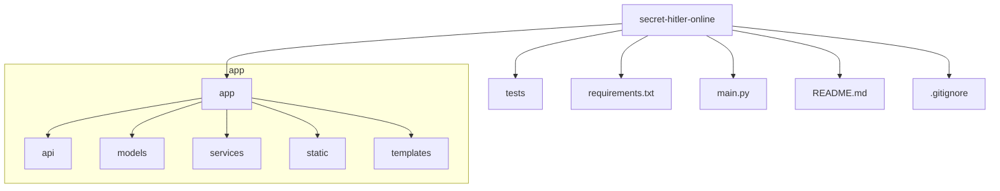

# Plan for US-001: Project Setup and Repository Initialization

This plan outlines the necessary steps to create a solid foundation for the "Secret Hitler Online" project, aligning with the technical stack and user story requirements.

### 1. Version Control Setup (GitHub)

*   **Action:** Create a new public repository on GitHub named `secret-hitler-online-game`.
*   **Rationale:** Establish version control for collaboration, change tracking, and project history.

### 2. Local Environment Setup

*   **Action:** Initialize a local Python virtual environment using Python 3.9+ and create a VS Code workspace configuration.
*   **Rationale:** Isolate project dependencies and configure the editor for consistency, including interpreter path and linting.
*   **Details:** Create `.vscode/settings.json` with recommended settings for the Python interpreter and linting.

### 3. Project Structure and Scaffolding

*   **Action:** Create the directory and file structure as defined in the user story.
*   **Rationale:** A well-organized project structure is crucial for maintainability and scalability. This structure separates concerns (API, models, services, tests, static assets) and follows common practices for FastAPI applications.

### 4. Dependency Management

*   **Action:** Install core Python packages (`fastapi`, `uvicorn[standard]`, `python-socketio`, `pydantic`, `pytest`, `aiofiles`) and generate a `requirements.txt` file.
*   **Rationale:** These packages form the backbone of the application. `pytest` is included for future testing (US-002) and `aiofiles` for asynchronous file serving. `requirements.txt` ensures a reproducible environment.

### 5. Initial Application Stub

*   **Action:** Create a minimal FastAPI application in `main.py` that serves a "Hello World" JSON response at the root endpoint (`/`).
*   **Rationale:** This verifies that the core framework is installed and configured correctly.
*   **Verification:** After running the app with `uvicorn main:app --reload`, test the endpoint using `curl http://localhost:8000` to ensure it returns the expected JSON response.

### 6. Source Control Configuration

*   **Action:** Create a standard Python `.gitignore` file.
*   **Rationale:** Prevents committing unnecessary files (e.g., virtual environment, cache files) to the Git repository, keeping the commit history clean.

### 7. Project Documentation

*   **Action:** Write a comprehensive `README.md` file with a project description and clear setup instructions.
*   **Rationale:** The README is the entry point for any developer, providing essential information to get started with the project.

### 8. Initial Commit

*   **Action:** Commit all the initial project files to the `main` branch of the GitHub repository.
*   **Rationale:** This finalizes the project setup, creating the initial baseline in version control for all future work.
